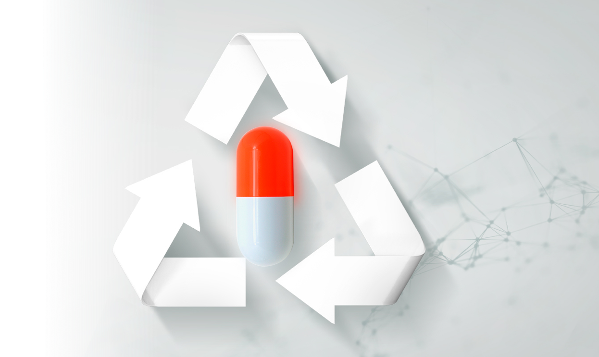

# Personal goals

We can no longer deny the ever increasing potential of AI, Through sheer computing power the metaphorical needles in the data haystacks can be found faster than ever. Pursuing a future career in Data Sciences means embracing AI, and after setting the first steps with computer vision and large language models I want to continue my journey with something more specific to bioinformatics. My choice has fallen on drug repurposing through predictive models. This research aims to find new uses for existing medicine by predicting how it might interact with biological pathways. It has the potential to significantly decrease the time and cost for developing new treatments, especially in the case of rare or complex diseases.

I will start by exploring papers on the topic, keeping an eye out for papers adhering to the Open Science principles. Whenever code and data is shared, I will try to rerun (parts of) the analysis to gain a better understanding of the techniques that are used in this field.

